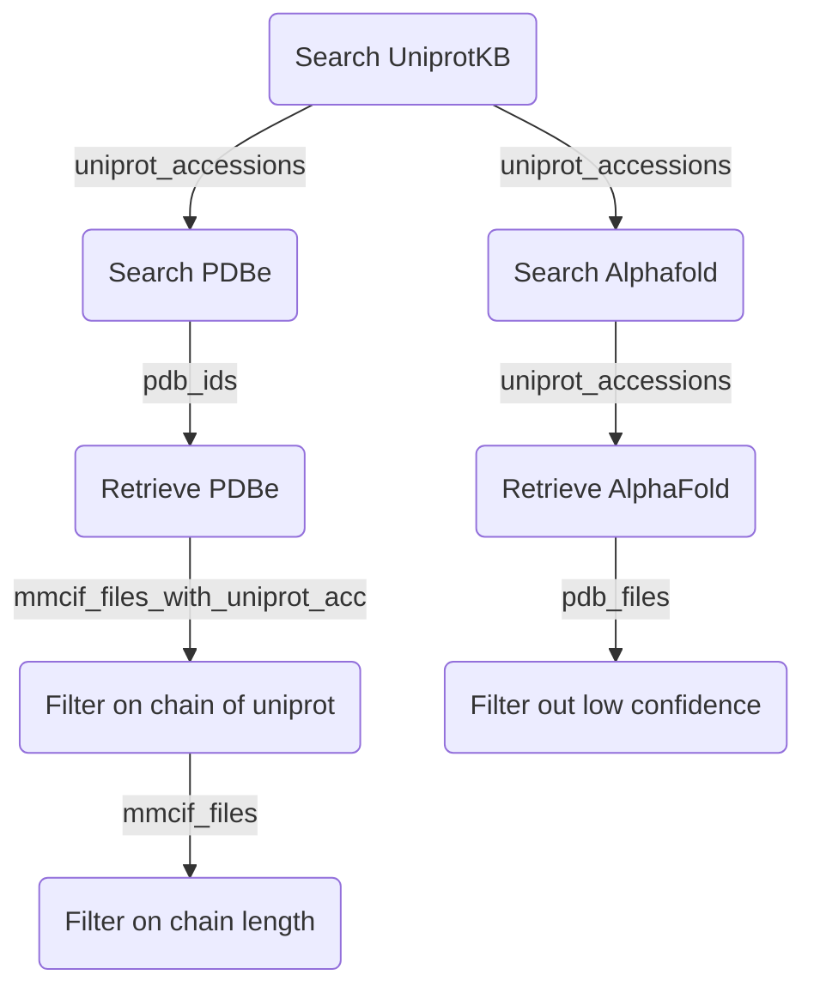

# protein-quest

[](https://www.bonvinlab.org/protein-quest/)
[](https://github.com/haddocking/protein-quest/actions/workflows/ci.yml)
[](https://www.research-software.nl/software/protein-quest)
[](https://pypi.org/project/protein-quest/)
[](https://doi.org/10.5281/zenodo.15632658)

Python package to search/retrieve/filter proteins and protein structures

It uses

- [Uniprot Sparql endpoint](https://sparql.uniprot.org/) to search for proteins and their measured or predicted 3D structures.
- [gemmi](https://project-gemmi.github.io/) to work with macromolecular models
- [dask-distributed](https://docs.dask.org/en/latest/) to compute in parallel

An example workflow:



## Install

```shell
pip install protein-quest
```

Or to use the latest development version:
```
pip install git+https://github.com/haddocking/protein-quest.git
```

## Usage

The main entry point is the `protein-quest` command line tool which has multiple subcommands to perform actions.

To use programmaticly, see [API documentation](https://www.bonvinlab.org/protein-quest/autoapi/summary/).

### Search Uniprot accessions

```shell
protein-quest search uniprot \
    --taxon-id 9606 \
    --reviewed \
    --subcellular-location-uniprot nucleus \
    --subcellular-location-go GO:0005634 \
    --molecular-function-go GO:0003677 \
    --limit 100 \
    uniprot_accs.txt
```
([GO:0005634](https://www.ebi.ac.uk/QuickGO/term/GO:0005634) is "Nucleus" and [GO:0003677](https://www.ebi.ac.uk/QuickGO/term/GO:0003677) is  "DNA binding")

### Search for PDBe structures of uniprot accessions

```shell
protein-quest search pdbe uniprot_accs.txt pdbe.csv
```

`pdbe.csv` file is written containing the the PDB id and chain of each uniprot accession.

### Search for Alphafold structures of uniprot accessions

```shell
protein-quest search alphafold uniprot_accs.txt alphafold.csv
```

### To retrieve PDB structure files

```shell
protein-quest retrieve pdbe pdbe.csv downloads-pdbe/
```

### To retrieve AlphaFold structure files

```shell
protein-quest retrieve alphafold alphafold.csv downloads-af/
```

For each entry downloads the summary.json and cif file.

### To filter AlphaFold structures on confidence

Filter AlphaFoldDB structures based on confidence (pLDDT).
Keeps entries with requested number of residues which have a confidence score above the threshold.
Also writes pdb files with only those residues.

```shell
protein-quest filter confidence \
    --confidence-threshold 50 \
    --min-residues 100 \
    --max-residues 1000 \
    ./downloads-af ./filtered
```

### To filter PDBe files on chain of uniprot accession

Make PDBe files smaller by only keeping first chain of found uniprot entry and renaming to chain A.

```shell
protein-quest filter chain \
    pdbe.csv \
    ./downloads-pdbe ./filtered-chains
```

### To filter PDBe files on nr of residues

```shell
protein-quest filter residue  \
    --min-residues 100 \
    --max-residues 1000 \
    ./filtered-chains ./filtered
```

##  Model Context Protocol (MCP) server

Protein quest can also help LLMs like Claude Sonnet 4 by providing a [set of tools](https://modelcontextprotocol.io/docs/learn/server-concepts#tools-ai-actions) for protein structures.


To run mcp server you have to install the `mcp` extra with:

```shell
pip install protein-quest[mcp]
# or in development
uv sync --all-extras --all-groups
```

The server can be started with:

```shell
protein-quest mcp
```

The mcp server contains an prompt template to search/retrieve/filter candidate structures.

## Contributing

For development information and contribution guidelines, please see [CONTRIBUTING.md](CONTRIBUTING.md).
